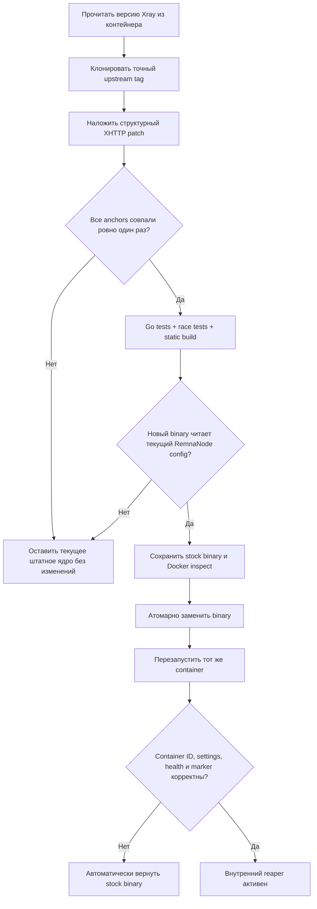

<div align="center">

# 🧬 RemnaNode XHTTP Cleaner

### Версионно-адаптивный форк Xray с внутренней очисткой старых XHTTP-буферов

[](https://github.com/wasteprince/remnanode-xhttp-cleaner)
[](#-требования)
[](#-как-работает-обновление)
[](LICENSE)

**XHTTP Cleaner v3.0.0 · by Bankaev**

[Установка](#-быстрая-установка) · [Принцип работы](#-как-это-работает) · [Управление](#-управление) · [Обновления](#-как-работает-обновление) · [Откат](#-откат)

</div>

---

> [!IMPORTANT]
> Версия 3.0.0 действительно изменяет Xray: собирает форк ровно от версии ядра, найденной в запущенном контейнере, атомарно заменяет `/usr/local/bin/xray` и перезапускает **тот же** контейнер. Контейнер не пересоздаётся, поэтому его env, mounts, ports, networks и restart policy сохраняются.

## ✨ Что делает программа

| Компонент | Назначение |
|---|---|
| Внутренний XHTTP reaper | Работает непосредственно в `splithttp` Xray и закрывает сессии только после ≥ 5 минут без полезных данных |
| Очистка очередей | Закрывает `uploadQueue`, освобождает ссылки на накопленные payload-буферы и вызывает отложенный `debug.FreeOSMemory()` |
| Защита новой сессии | Использует `sync.Map.CompareAndDelete(sessionID, expectedSessionPointer)`: новый объект с тем же IP или session ID не удаляется |
| Учёт двух направлений | Обновляет время активности при реальном upload payload/read и downstream write; служебный stream-up padding активностью не считается |
| Compatibility gate | Перед установкой применяет структурный патч, запускает Go-тесты, отдельный race-тест и проверяет действующий RemnaNode-конфиг новым бинарником |
| Автоматическое сопровождение | Каждые 5 минут проверяет ядро; после обновления RemnaNode собирает новый форк для новой версии |
| Fail closed | Если структура новой версии Xray несовместима, новое штатное ядро остаётся нетронутым — старый форк поверх него не устанавливается |
| Атомарный откат | Хранит оригинальный бинарник, Docker inspect и контрольные суммы; при неуспешном старте автоматически возвращает оригинал |
| Внешняя страховка | Сохраняет очистку старых TCP-сокетов через `NETLINK_SOCK_DIAG` с inode + 64-битным kernel cookie |

## 🚀 Быстрая установка

Docker и работающий контейнер RemnaNode должны быть установлены заранее.

```bash
sudo apt update
sudo apt install -y git

sudo mkdir -p /opt/node-xhttp
cd /opt/node-xhttp
sudo git clone https://github.com/wasteprince/remnanode-xhttp-cleaner.git .

sudo chmod +x install.sh
sudo ./install.sh
```

Если контейнер называется не `remnanode`:

```bash
cd /opt/node-xhttp
sudo env REMNANODE_CONTAINER=my-remnanode ./install.sh
```

Во время первой установки будет загружен Docker builder с нужной версией Go, собраны зависимости Xray, выполнены тесты и один раз перезапущен контейнер. Это может занять несколько минут. После завершения автоматически запускаются служба и команда управления:

```bash
xhttp-cleaner
```

## 🛡️ Как это работает



### Логика внутренней очистки

Для каждой серверной XHTTP-сессии форк хранит время последней полезной активности. Проверка выполняется каждые 5 минут. Сессия удаляется, только если одновременно верны условия:

1. полезные данные не читались и не записывались не менее 300 секунд;
2. в `sessions` по прежнему зарегистрирован именно тот же объект сессии;
3. `CompareAndDelete` атомарно подтвердил и удалил этот объект;
4. очередь относится к этой старой сессии, а не к новой сессии с таким же ID.

После закрытия очереди обработчики завершаются, Go GC теряет ссылки на её payload slices, а вызов `debug.FreeOSMemory()` возвращает свободные страницы операционной системе. Вызов ограничен одним разом за пятиминутный интервал, чтобы не создавать постоянные stop-the-world паузы.

Исходное правило Xray для незавершённой сессии без GET сохранено: такая сессия может быть закрыта через 30 секунд.

## 🎛️ Управление

### Интерактивная панель

```bash
xhttp-cleaner
```

Панель показывает состояние timer, версию и marker форка, контейнер RemnaNode, RSS Xray, сокеты и последние результаты.

### Команды

| Команда | Что делает |
|---|---|
| `xhttp-cleaner status` | Панель состояния без изменений |
| `xhttp-cleaner scan` | Показать старые TCP-сокеты без закрытия |
| `xhttp-cleaner clean` | Немедленно повторно проверить и закрыть старые сокеты |
| `xhttp-cleaner logs` | Последние 100 строк журнала |
| `xhttp-cleaner logs --follow` | Следить за журналом |
| `xhttp-cleaner enable` | Включить systemd timer и выполнить проверку |
| `xhttp-cleaner disable` | Остановить автоматические проверки; установленный внутренний reaper остаётся в ядре до отката |
| `xhttp-cleaner core-update` | Принудительно повторить compatibility gate, сборку и установку |
| `xhttp-cleaner core-rollback` | Восстановить сохранённый оригинальный Xray |
| `xhttp-cleaner test` | Запустить локальные тесты проекта |
| `xhttp-cleaner reinstall` | Повторно запустить `/opt/node-xhttp/install.sh` |
| `xhttp-cleaner uninstall` | Восстановить оригинальный Xray и удалить программу |

Низкоуровневые команды:

```bash
sudo /usr/local/lib/remnanode-xhttp-clean/xray-core-manager status
sudo /usr/local/lib/remnanode-xhttp-clean/xray-core-manager ensure --retry-failed
sudo /usr/local/lib/remnanode-xhttp-clean/xray-core-manager rollback
```

## 🔄 Как работает обновление

Systemd timer запускается через 5 минут после загрузки и далее раз в 5 минут. Перед внешней очисткой сокетов `ExecStartPre` проверяет ядро.

- Если marker `xhttp-cleaner-v3` уже присутствует, сборка не запускается.
- Если RemnaNode пересоздал контейнер с той же версией Xray, готовый проверенный artifact устанавливается повторно.
- Если версия Xray изменилась, клонируется **ровно** tag `v<текущая-версия>`, после чего весь gate выполняется заново.
- Если upstream изменил нужные структуры, patcher прекращает работу до первой записи, записывает причину и не повторяет тяжёлую сборку каждые 5 минут.
- Для ручной повторной попытки после обновления самого Cleaner используется `core-update`.

Невозможно честно гарантировать, что любой будущий Xray сохранит внутреннюю архитектуру. Поэтому совместимость обеспечивается не «слепым» применением старого patch-файла, а строгим правилом: новая версия либо полностью патчится, компилируется, тестируется и запускается, либо остаётся штатной.

Обновление самого проекта:

```bash
cd /opt/node-xhttp
sudo git pull
sudo ./install.sh
```

## ↩ Откат

```bash
sudo xhttp-cleaner core-rollback
```

Откат проверяет checksum оригинального бинарника и ID контейнера, атомарно возвращает файл и перезапускает тот же контейнер. Если контейнер был пересоздан после последнего deploy, автоматический откат намеренно прекращается: старый бинарник нельзя безопасно переносить в неизвестную новую среду.

При удалении Cleaner сначала обязан восстановить оригинальное ядро. Если безопасный откат невозможен, удаление прерывается и сохраняет backup/metadata для ручного восстановления.

## ⚙️ Конфигурация

Файл `/etc/remnanode-xhttp-clean.json` относится к внешней socket-страховке:

```json
{
  "container": "remnanode",
  "idle_seconds": 300,
  "include_inbound": false,
  "exclude_loopback": true,
  "clean_xhttp_buffers": true
}
```

`idle_seconds` нельзя установить ниже 300. Внутренний reaper форка также имеет безопасный минимум 5 минут и не зависит от неточного определения TCP idle снаружи процесса.

## 📁 Устанавливаемые данные

| Путь | Назначение |
|---|---|
| `/usr/local/sbin/remnanode-xhttp-clean` | Внешний socket cleaner |
| `/usr/local/bin/xhttp-cleaner` | Панель управления |
| `/usr/local/lib/remnanode-xhttp-clean/` | Core manager и version-gated patch assets |
| `/etc/remnanode-xhttp-clean.json` | Конфигурация |
| `/etc/systemd/system/remnanode-xhttp-clean.service` | One-shot служба |
| `/etc/systemd/system/remnanode-xhttp-clean.timer` | Пятиминутный timer |
| `/var/lib/remnanode-xhttp-clean/` | Stock binaries, checksums, deployment metadata и Docker inspect |
| `/var/cache/remnanode-xhttp-clean/` | Собранные artifacts и Go cache |

> [!WARNING]
> Docker inspect может содержать секретные env-переменные. Файлы состояния создаются с правами `0600`, каталоги backup — `0700`. Не публикуйте их.

## 🧪 Тесты

```bash
cd /opt/node-xhttp
python3 -m unittest -v \
  tests/test_cleaner.py \
  tests/test_core_manager.py \
  tests/test_xray_patcher.py
bash tests/test_install.sh
```

Во время реальной сборки дополнительно запускаются upstream-тесты `transport/internet/splithttp` и race-тесты новых функций. Затем собранный статический ELF проверяется на действующем конфиге внутри RemnaNode.

## 📋 Требования

- Ubuntu с systemd;
- root-доступ;
- запущенный Docker и контейнер RemnaNode;
- доступ к `github.com/XTLS/Xray-core` и Docker Hub во время новой сборки;
- архитектура `amd64` или `arm64`;
- свободное место для исходников, Go modules и builder image.

Установщик добавляет `python3`, `git`, `util-linux` и CA certificates. Docker должен быть установлен заранее.

## ⚠️ Ограничения и эксплуатационные нюансы

- Установка нового ядра и автоматическое применение после обновления требуют перезапуска контейнера; текущие соединения на этот момент оборвутся.
- Источником форка служит официальный `XTLS/Xray-core`. Контейнер с другим приватным форком при несовместимой структуре не пройдёт gate.
- `debug.FreeOSMemory()` помогает вернуть свободные страницы ОС, но итоговый RSS зависит также от активных соединений, других подсистем Xray и фрагментации heap.
- Скрипт не редактирует RemnaNode config, Docker Compose или лимиты памяти.
- Откат нельзя безопасно автоматизировать через смену ID контейнера без точного знания новой версии; в таком случае операция останавливается.

## 🗑️ Удаление

```bash
xhttp-cleaner uninstall
```

После подтверждения программа восстановит stock Xray, перезапустит контейнер, а затем удалит service, timer, команды, backup и build cache. Исходный Git-репозиторий в `/opt/node-xhttp` останется.

## 📚 Технические источники

- [Xray-core XHTTP session handler](https://github.com/XTLS/Xray-core/blob/v26.6.27/transport/internet/splithttp/hub.go)
- [Xray-core upload queue](https://github.com/XTLS/Xray-core/blob/v26.6.27/transport/internet/splithttp/upload_queue.go)
- [Go `debug.FreeOSMemory`](https://pkg.go.dev/runtime/debug#FreeOSMemory)
- [RemnaNode Dockerfile](https://github.com/remnawave/node/blob/main/Dockerfile)
- [Linux `sock_diag(7)`](https://man7.org/linux/man-pages/man7/sock_diag.7.html)

---

<div align="center">

Сделано **by Bankaev**

[⬆ Вернуться к началу](#-remnanode-xhttp-cleaner)

</div>
