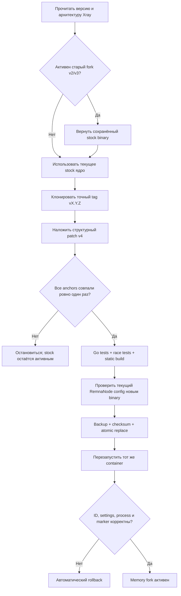

> [!CAUTION]
> **Этот проект предназначен только для серверного Xray внутри RemnaNode.** Он не устанавливается на клиентские устройства, не меняет клиентское ядро и не устраняет расход памяти в клиентских приложениях. Оптимизируется исключительно сервер.

> [!WARNING]
> **Автор не несёт ответственности за крупную утечку памяти на клиенте, если пользователь не выполнил приведённые ниже рекомендации для настроек хоста Remnawave.** Серверный форк не может принудительно исправить параметры уже настроенных клиентских подключений.

> [!WARNING]
> **Скрипт предназначен только для Xray 26.6.x и более новых версий.** Полный цикл patch/tests/race/build подтверждён для `v26.6.27` и `v26.7.11`. Старые ядра, включая `v26.3.27`, имеют другую внутреннюю реализацию XHTTP `uploadQueue` и не поддерживаются. Для каждой новой версии всё равно выполняется compatibility gate: если структуры Xray изменились, установка безопасно остановится без применения несовместимого патча.

<div align="center">

# 🧬 RemnaNode XHTTP Cleaner

### Безопасный memory fork для XHTTP, TCP и gRPC

[](https://github.com/wasteprince/remnanode-xhttp-cleaner)
[](#-требования)
[](#-безопасное-обновление-ядра)
[](LICENSE)

**v4.0.0 · by Bankaev**

[Установка](#-установка) · [Архитектура](#-что-изменяет-v400) · [CPU](#-оптимизация-cpu) · [Настройки хоста](#-рекомендации-для-настроек-хоста-remnawave) · [Управление](#-управление) · [Откат](#-откат)

</div>

---

> [!IMPORTANT]
> Установщик собирает форк из **точного upstream-тега текущего Xray**, заменяет бинарник внутри уже существующего контейнера и один раз перезапускает этот же контейнер. Docker Compose, env, mounts, ports, networks и restart policy не переписываются. Перезапуск прерывает текущие соединения, поэтому первую установку лучше выполнять в окно обслуживания.

## Зачем появилась v4

Перед разработкой v4 тесты и подробный аудит проводились на **специальном нагруженном сервере RemnaNode**, где одновременно работали XHTTP и продолжительный межсерверный TCP-мост. Это был практический стенд с реальной длительной нагрузкой, а не только синтетический unit-тест.

На тестовом сервере мы столкнулись со следующими проблемами:

- при примерно 18 тысячах TCP-соединений Xray занимал 2,4–2,9 ГиБ RSS;
- учтённая cgroup память TCP-сокетов составляла около 50 МиБ;
- почти весь остальной объём находился в Go heap/runtime Xray;
- CPU тратился главным образом на тысячи небольших `read`/`write` и системные вызовы, а не на зависший цикл;
- старый внешний обход всех `ESTABLISHED` каждые пять минут создавал дополнительную нагрузку;
- внешний cleaner мог принять легальный, но временно не передающий данные TCP-мост за старое соединение;
- завершённые XHTTP-сессии и освобождённые Go-буферы не всегда быстро возвращали страницы памяти операционной системе;
- стандартная очередь Xray до 512 КиБ на направление слишком сильно увеличивала потенциальное удержание памяти при тысячах одновременных сессий.

Поэтому v4 не пытается «освободить гигабайты» удалением kernel-сокетов. Она ограничивает удержание памяти **внутри Xray**, централизованно возвращает уже недостижимые страницы Linux и по умолчанию не закрывает активные XHTTP/TCP/gRPC-соединения.

> [!NOTE]
> **Оптимизация TCP и gRPC в первую очередь предназначена для серверных outbound-соединений, используемых как мост между двумя серверами.** Долгоживущий межсерверный поток может временно не передавать данные, поэтому Cleaner защищает такие `ESTABLISHED`-соединения от внешнего закрытия и оптимизирует их память через общую pipe policy и memory optimizer внутри Xray.

## ✨ Что изменяет v4.0.0

| Механизм | Что происходит | Защита протоколов |
|---|---|---|
| XHTTP session reaper | Один reaper на listener проверяет полезную upload/download-активность раз в 5 минут | Сессия закрывается только после ≥300 секунд без payload; используется `CompareAndDelete(sessionID, exactPointer)` |
| HTTP keep-alive | `IdleTimeout=5m` освобождает соединение, которое ждёт следующий HTTP request | Активный handler/stream этим timeout не прерывается |
| Общая pipe policy | Стандартный amd64 budget очереди уменьшается с 512 до 128 КиБ на направление | Формат протокола не меняется; явно заданный пользователем `bufferSize` имеет приоритет |
| Общий memory optimizer | Работает с памятью XHTTP, raw TCP и gRPC; каждые 5 минут делает двухэтапный GC/reclaim при заметном runtime footprint | Достижимые буферы живых соединений GC удалить не может |
| Cgroup-aware limit | Уважает `GOMEMLIMIT`; иначе ставит мягкий лимит Go до 70% доступного cgroup/host ceiling | Это soft limit, а не OOM-kill и не Docker memory limit |
| Внешняя очистка | По умолчанию рассматривает только `CLOSE_WAIT`, неактивный ≥5 минут | Любой `ESTABLISHED` outbound, включая долгий TCP-мост, защищён по умолчанию |
| Защита от reuse | Перед `SOCK_DESTROY` повторно сверяются inode, tuple и 64-битный kernel cookie | Новый сокет с тем же IP/портами не совпадёт с cookie старого |
| Version gate | Структурные anchors, upstream Go tests, race tests, static build и проверка активного RemnaNode config | При несовместимости новое штатное ядро остаётся нетронутым |
| Rollback | Сохраняются stock binary, checksum, container ID и Docker inspect | Ошибка старта автоматически возвращает оригинальный бинарник |

### Как освобождается память

Xray использует общие очереди и `sync.Pool`. После завершения сессии ссылки на payload становятся недостижимыми, но страницы не обязаны немедленно исчезать из RSS. Общий optimizer выполняет две стадии:

1. `runtime.GC()` переводит прежнее поколение `sync.Pool` в victim cache;
2. `debug.FreeOSMemory()` выполняет следующую сборку и scavenging свободных страниц Linux.

Полный цикл запускается не чаще одного раза в пять минут и только когда runtime footprint достиг `max(256 MiB, memory ceiling / 16)`. XHTTP reaper не запускает второй независимый GC — это устраняет дублирующие паузы.

> [!NOTE]
> RSS не обязан упасть до условных 100–200 МиБ. Память активных сессий, таблиц маршрутизации, TLS/Reality, статистики и фрагментация heap остаются. Оптимизатор возвращает только действительно свободную память.

## ⚙️ Оптимизация CPU

Безопасное уменьшение CPU в v4 построено на сокращении служебной работы:

- внешний timer больше не выгружает и не разбирает все тысячи `ESTABLISHED` по умолчанию;
- XHTTP использует один reaper на listener, а не отдельный вечный watcher на каждую сессию;
- idle HTTP keep-alive освобождаются без вмешательства в активный stream;
- GC для XHTTP/TCP/gRPC объединён в один ограниченный цикл;
- в панели отдельно показывается текущий CPU процесса Xray (`100% = один vCore`).

Намеренно **не изменяются**:

- gRPC dynamic BDP и HTTP/2 flow-control windows;
- gRPC read/write buffer size;
- Linux `tcp_rmem`, `tcp_wmem`, autotuning, BBR и congestion control;
- XHTTP framing, padding, packet-up и криптография;
- timeout живого TCP/gRPC-потока.

Уменьшение этих буферов могло бы увеличить число syscalls или снизить скорость длинного межсерверного моста. При трафике из множества небольших XHTTP-запросов основная CPU-стоимость является частью выбранного transport mode; полностью убрать её серверным GC невозможно.

## 🔧 Рекомендации для настроек хоста Remnawave

Эти параметры необходимо указывать **в настройках хоста Remnawave**. Они не относятся к JSON-конфигурации Cleaner, Docker Compose, Linux `sysctl` или ручной настройке клиентского приложения.

> [!IMPORTANT]
> После изменения хоста обновите подписку/профиль на клиентах, чтобы они получили актуальные параметры. Если клиент продолжает использовать старую конфигурацию, серверный memory fork не сможет предотвратить накопление памяти на этом клиенте.

### XHTTP-параметры хоста

```json
{
  "xmux": {
    "cMaxReuseTimes": "200-300",
    "maxConnections": 1,
    "hKeepAlivePeriod": 60,
    "hMaxRequestTimes": "200-300",
    "hMaxReusableSecs": "600-900"
  },
  "xPaddingBytes": "100-500",
  "scMaxEachPostBytes": "393216-786432"
}
```

Эти значения ограничивают чрезмерно долгое повторное использование XHTTP-соединений и запросов, сохраняя контролируемый жизненный цикл mux-сессии. Диапазоны оставлены строками, как их ожидает конфигурация XHTTP.

### SockOpt-параметры хоста

```json
{
  "tcpcongestion": "bbr",
  "domainStrategy": "AsIs",
  "tcpUserTimeout": 10000,
  "tcpKeepAliveIdle": 300,
  "tcpKeepAliveInterval": 60
}
```

SockOpt задаёт предсказуемое обнаружение неработающих TCP-путей и keep-alive без агрессивного закрытия активного трафика. `tcpUserTimeout` указывается в миллисекундах, а `tcpKeepAliveIdle` и `tcpKeepAliveInterval` — в секундах.

Не смешивайте оба блока: XHTTP-параметры должны находиться в XHTTP-настройках хоста, а SockOpt — в соответствующем поле SockOpt этого же хоста.

## 🚀 Установка

Docker, запущенный контейнер RemnaNode и Xray версии **26.6.x или новее** должны существовать заранее.

### Обновление RemnaNode перед установкой

Если в контейнере используется Xray старее 26.6, сначала обновите RemnaNode:

```bash
cd /opt/remnanode && docker compose pull && docker compose down && docker compose up -d && docker compose logs -f
```

Команда `docker compose logs -f` продолжает показывать журнал до нажатия `Ctrl+C`; это не останавливает запущенный контейнер. Операции `down` и `up` пересоздают контейнер и прерывают текущие подключения, поэтому обновление следует выполнять в окно обслуживания.

После запуска проверьте фактическую версию Xray в новом контейнере. Обновление RemnaNode не является гарантией конкретной версии ядра: если образ всё ещё содержит Xray старее 26.6, устанавливать Cleaner нельзя.

### Установка Cleaner

```bash
sudo apt update
sudo apt install -y git

sudo mkdir -p /opt/node-xhttp
cd /opt/node-xhttp
sudo git clone https://github.com/wasteprince/remnanode-xhttp-cleaner.git .

sudo chmod +x install.sh
sudo ./install.sh
```

Если контейнер называется не `remnanode`:

```bash
cd /opt/node-xhttp
sudo env REMNANODE_CONTAINER=my-remnanode ./install.sh
```

Первая сборка загружает нужный Go builder и зависимости, запускает тесты, устанавливает бинарник, автоматически включает systemd timer и выполняет первый запуск. После успешной сборки удаляется только одноразовый Go build cache этого проекта; module cache и готовый artifact сохраняются.

Открыть панель:

```bash
xhttp-cleaner
```

## 🛡️ Схема установки



## 🎛️ Управление

| Команда | Действие |
|---|---|
| `xhttp-cleaner` | Интерактивная панель by Bankaev |
| `xhttp-cleaner status` | RAM, CPU Xray, сокеты, transports, marker и статистика reclaim |
| `xhttp-cleaner scan` | Показать только разрешённых конфигурацией кандидатов без изменений |
| `xhttp-cleaner clean` | Повторно проверить и закрыть безопасных кандидатов |
| `xhttp-cleaner logs [--follow]` | Показать журнал или следить за ним |
| `xhttp-cleaner enable` | Включить timer и сразу выполнить обслуживание |
| `xhttp-cleaner disable` | Остановить внешний timer; внутренний код действует до rollback/restart |
| `xhttp-cleaner test` | Запустить тесты репозитория |
| `xhttp-cleaner core-update` | Повторить compatibility gate и установку форка |
| `xhttp-cleaner core-rollback` | Восстановить сохранённый оригинальный Xray |
| `xhttp-cleaner reinstall` | Повторно запустить `/opt/node-xhttp/install.sh` |
| `xhttp-cleaner uninstall` | Сначала вернуть stock Xray, затем удалить программу |

Обновить проект:

```bash
cd /opt/node-xhttp
sudo git pull
sudo ./install.sh
```

## 🔄 Безопасное обновление ядра

Timer запускается через пять минут после загрузки и далее раз в пять минут. `ExecStartPre` проверяет marker и версию ядра.

- При `xhttp-cleaner-v4` той же версии тяжёлая сборка не запускается.
- После пересоздания контейнера готовый version/architecture artifact можно установить повторно.
- Для новой версии клонируется ровно `v<версия>` и весь gate выполняется заново.
- Если anchors изменились, patcher прекращает работу **до первой записи**.
- Неудачная версия фиксируется, поэтому timer не запускает тяжёлую сборку снова каждые пять минут.
- Обновление с v3 сначала восстанавливает его сохранённый stock binary и лишь затем создаёт v4; старый форк никогда не записывается как «оригинал».

Ни один patch не может честно гарантировать совместимость со всеми будущими внутренними изменениями Xray. Здесь гарантия другая: новая версия либо полностью патчится, тестируется и проходит runtime validation, либо остаётся штатной.

## ↩ Откат

```bash
sudo xhttp-cleaner core-rollback
```

Откат сверяет checksum и container ID, возвращает оригинальный файл и перезапускает тот же контейнер. Если контейнер уже пересоздан, перенос старого бинарника намеренно запрещён.

При неуспешном старте диагностический snapshot сохраняется с правами `0600`:

```text
/var/lib/remnanode-xhttp-clean/diagnostics/*-health-failure-*.json
```

Он может содержать IP из Docker logs — проверяйте файл перед публикацией.

## 🧰 Конфигурация внешней страховки

`/etc/remnanode-xhttp-clean.json`:

```json
{
  "container": "remnanode",
  "idle_seconds": 300,
  "include_inbound": false,
  "exclude_loopback": true,
  "clean_xhttp_buffers": false,
  "clean_close_wait": true,
  "clean_established_outbound": false
}
```

Безопасные defaults означают:

- `CLOSE_WAIT` можно закрыть только после ≥300 секунд без данных;
- обычные `ESTABLISHED` outbound не закрываются — долгий TCP-мост защищён;
- XHTTP `ESTABLISHED` обслуживает внутренний reaper, поэтому внешний destroy выключен;
- inbound и loopback не затрагиваются.

`idle_seconds` нельзя установить ниже 300. Включение `clean_established_outbound`, `clean_xhttp_buffers` или `include_inbound` — осознанный legacy/fallback режим; cookie-проверка остаётся, но намеренно idle соединение всё равно может быть оборвано.

### Настройки memory optimizer

Optimizer сначала уважает существующий `GOMEMLIMIT`. Дополнительные env предназначены для опытного администратора и должны задаваться контейнеру штатным способом RemnaNode/Docker:

| Переменная | Значение по умолчанию |
|---|---|
| `XRAY_MEMORY_OPTIMIZER` | включён; `false` отключает |
| `XRAY_MEMORY_OPTIMIZER_INTERVAL` | `5m`, минимум `1m` |
| `XRAY_MEMORY_LIMIT` | автоматически 70% эффективного ceiling |
| `XRAY_MEMORY_OPTIMIZER_MIN_BYTES` | `max(256MiB, ceiling/16)` |
| `XRAY_MEMORY_OPTIMIZER_FORCE` | `false`; `true` запускает reclaim каждый tick |
| `XRAY_MEMORY_OPTIMIZER_STATUS` | `/tmp/xray-memory-optimizer.json` |
| `XHTTP_CLEANER_KEEP_BUILD_CACHE` | пусто; `true` сохраняет Go build cache на host |

Скрипт не редактирует Compose и не добавляет эти env автоматически.

## 📁 Устанавливаемые файлы

| Путь | Назначение |
|---|---|
| `/usr/local/sbin/remnanode-xhttp-clean` | Внешняя socket-страховка и status |
| `/usr/local/bin/xhttp-cleaner` | Панель управления |
| `/usr/local/lib/remnanode-xhttp-clean/` | Core manager и patch assets |
| `/etc/remnanode-xhttp-clean.json` | Конфигурация внешней очистки |
| `/etc/systemd/system/remnanode-xhttp-clean.{service,timer}` | Пятиминутное обслуживание |
| `/var/lib/remnanode-xhttp-clean/` | Stock backup, checksums, metadata и diagnostics |
| `/var/cache/remnanode-xhttp-clean/artifacts/` | Проверенные готовые бинарники |
| `/var/cache/remnanode-xhttp-clean/go-mod/` | Повторно используемые Go modules |

> [!WARNING]
> Docker inspect и diagnostics могут содержать секретные env или IP. State-файлы создаются `0600`, backup-каталоги — `0700`. Не публикуйте их без проверки.

## 🧪 Проверки

```bash
cd /opt/node-xhttp
python3 -m unittest discover -s tests -v
bash tests/test_install.sh
```

Реальная сборка дополнительно выполняет:

- upstream tests для `splithttp`, `grpc`, `policy` и `main`;
- race tests XHTTP reaper и memory optimizer;
- `gofmt` и статическую `CGO_ENABLED=0` сборку;
- запуск нового binary в test mode на текущем rendered config;
- после рестарта — проверку container ID, Docker settings, процесса и build marker.

## 📋 Требования

- Ubuntu с systemd;
- root-доступ;
- работающие Docker и RemnaNode;
- Xray 26.6.x или новее; более старые реализации XHTTP не поддерживаются;
- архитектура `amd64` или `arm64`;
- доступ к GitHub и Docker Hub при новой сборке;
- свободное место для исходников, modules и builder image.

Установщик добавляет `python3`, `git`, `util-linux` и CA certificates. Docker заранее не устанавливается и не перенастраивается.

## ⚠️ Ограничения

- Deploy/rollback перезапускает контейнер и обрывает текущие соединения.
- Форк не меняет клиентский Xray и не лечит клиентскую память.
- Активный поток никогда не освобождается как «старый», поэтому его рабочая память остаётся.
- Явный `bufferSize` в policy может переопределить новый default.
- Установка поверх неизвестного стороннего форка не выполняется автоматически.
- Программа не чистит чужие Docker images, journal, APT cache и не меняет sysctl.
- `FreeOSMemory` не является обещанием конкретного RSS: результат зависит от live heap и нагрузки.

## 🗑️ Удаление

```bash
xhttp-cleaner uninstall
```

После подтверждения сначала восстанавливается stock Xray. Только после успешного восстановления удаляются service, timer, команда, state и project cache. Git-каталог `/opt/node-xhttp` остаётся.

## 📚 Технические источники

- [Xray transport policy и `bufferSize`](https://xtls.github.io/en/config/policy.html)
- [Xray gRPC transport](https://xtls.github.io/config/transports/grpc.html)
- [Xray-core v26.6.27 XHTTP handler](https://github.com/XTLS/Xray-core/blob/v26.6.27/transport/internet/splithttp/hub.go)
- [Xray-core v26.6.27 default policy](https://github.com/XTLS/Xray-core/blob/v26.6.27/features/policy/policy.go)
- [Xray-core v26.7.11 reloadable default policy](https://github.com/XTLS/Xray-core/blob/v26.7.11/features/policy/policy.go)
- [Go GC guide: soft memory limit и RSS model](https://go.dev/doc/gc-guide)
- [Go runtime/debug](https://pkg.go.dev/runtime/debug)
- [grpc-go server buffer/window options](https://pkg.go.dev/google.golang.org/grpc)
- [Linux cgroup v2 memory controller](https://www.kernel.org/doc/html/latest/admin-guide/cgroup-v2.html)
- [Linux TCP sysctl](https://www.kernel.org/doc/html/latest/networking/ip-sysctl.html)
- [Linux `sock_diag(7)`](https://man7.org/linux/man-pages/man7/sock_diag.7.html)

---

<div align="center">

Сделано **by Bankaev**

[⬆ Вернуться к началу](#-remnanode-xhttp-cleaner)

</div>
