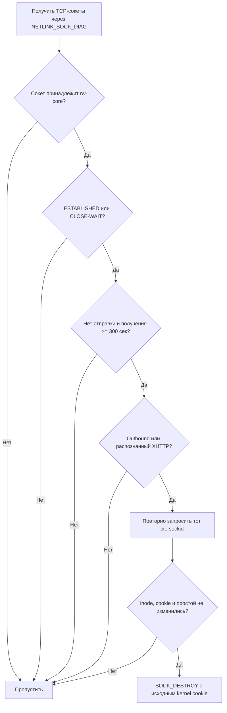

<div align="center">

# 🧹 RemnaNode XHTTP Cleaner

### Безопасная очистка старых TCP-сокетов и связанных XHTTP-буферов `rw-core`

[](https://github.com/wasteprince/remnanode-xhttp-cleaner)
[](#requirements)
[](#requirements)
[](LICENSE)

**XHTTP Cleaner v2.2.0 · by Bankaev**

[Быстрая установка](#quick-start) · [Как это работает](#how-it-works) · [Управление](#control) · [Конфигурация](#configuration) · [Ограничения](#limitations)

</div>

---

> [!IMPORTANT]
> Очиститель не изменяет Config Profile Xray, Docker Compose, лимиты памяти или параметры ядра и не перезапускает контейнер RemnaNode.

## ✨ Возможности

| Возможность | Что делает |
|---|---|
| 🧠 Очистка XHTTP | Находит неактивные TCP-соединения XHTTP/splithttp и освобождает связанные сетевые буферы |
| 🛡️ Защита от race condition | Повторно проверяет inode, активность и 64-битный kernel socket cookie непосредственно перед закрытием |
| 🎯 Точный выбор процесса | Работает только с сокетами текущего процесса `rw-core`/`xray` |
| 🔍 Безопасный scan | Показывает кандидатов без каких-либо изменений |
| 🐳 Работа с Docker | Выполняет socket-diag внутри network namespace контейнера, не меняя сам контейнер |
| ⏱️ Автоматический запуск | Использует короткую systemd `oneshot`-службу и timer вместо постоянно работающего фонового процесса |
| 🖥️ Панель управления | Устанавливает команду `xhttp-cleaner` со статусом, логами, тестами и управлением службой |
| ♻️ Повторная установка | Сохраняет существующий конфигурационный файл при обновлении |

<a id="quick-start"></a>

## 🚀 Быстрая установка

> [!NOTE]
> Docker и контейнер RemnaNode должны быть установлены и запущены заранее.

```bash
sudo apt update
sudo apt install -y git

sudo mkdir -p /opt/node-xhttp
cd /opt/node-xhttp
sudo git clone https://github.com/wasteprince/remnanode-xhttp-cleaner.git .

sudo chmod +x install.sh
sudo ./install.sh
```

После установки сразу появится команда:

```bash
xhttp-cleaner
```

`install.sh` автоматически:

1. проверит Ubuntu, Docker и файлы проекта;
2. установит `python3`, `util-linux` и `ca-certificates`;
3. найдёт запущенный контейнер RemnaNode;
4. создаст конфигурацию, если она ещё отсутствует;
5. установит программу и панель управления;
6. создаст и включит systemd service/timer;
7. сразу выполнит первую очистку.

<details>
<summary><strong>Если контейнер называется не remnanode</strong></summary>

Установщик сам выберет контейнер, если запущен ровно один контейнер с образом `remnawave/node`. Имя также можно передать явно:

```bash
cd /opt/node-xhttp
sudo env REMNANODE_CONTAINER=my-remnanode ./install.sh
```

Существующая конфигурация `/etc/remnanode-xhttp-clean.json` не перезаписывается. Если она уже создана, имя контейнера необходимо менять непосредственно в ней.

</details>

<a id="control"></a>

## 🎛️ Управление

### Интерактивная панель

```bash
xhttp-cleaner
```

Панель показывает:

- загрузку CPU, RAM и диска;
- состояние systemd timer;
- контейнер и образ RemnaNode;
- RSS процесса Xray;
- количество TCP-сокетов Xray;
- старые outbound- и XHTTP-соединения;
- обнаруженные XHTTP-listener’ы;
- результат и время следующего запуска.

### Команды

| Команда | Назначение | Изменяет состояние |
|---|---|:---:|
| `xhttp-cleaner` | Открыть интерактивную панель | — |
| `xhttp-cleaner status` | Показать состояние программы | Нет |
| `xhttp-cleaner scan` | Показать старые соединения | Нет |
| `xhttp-cleaner clean` | Выполнить повторную проверку и очистку | Да |
| `xhttp-cleaner logs` | Показать последние 100 строк журнала | Нет |
| `xhttp-cleaner logs --follow` | Следить за журналом в реальном времени | Нет |
| `xhttp-cleaner enable` | Включить timer и сразу выполнить очистку | Да |
| `xhttp-cleaner disable` | Отключить только очиститель и его timer | Да |
| `xhttp-cleaner test` | Запустить тесты из `/opt/node-xhttp` | Нет |
| `xhttp-cleaner reinstall` | Повторно запустить `/opt/node-xhttp/install.sh` | Да |
| `xhttp-cleaner uninstall` | Удалить установленную программу после подтверждения | Да |
| `xhttp-cleaner help` | Показать справку | Нет |

Если команда запущена не от root, панель попробует перезапустить себя через `sudo`. Отключение очистителя не останавливает и не перезапускает RemnaNode.

<a id="how-it-works"></a>

## 🛡️ Как это работает

Очиститель проверяет TCP-сокеты процесса `rw-core` в состояниях `ESTABLISHED` и `CLOSE-WAIT`.



### Условия закрытия

Сокет закрывается, только когда выполнены **все** условия:

1. inode сокета принадлежит текущему процессу `rw-core`/`xray`;
2. состояние сокета — `ESTABLISHED` или `CLOSE-WAIT`;
3. с последней отправки и последнего получения данных прошло не менее `idle_seconds`;
4. сокет является outbound-соединением либо принят распознанным XHTTP-listener’ом;
5. loopback исключён для outbound и обычных inbound-соединений;
6. непосредственно перед закрытием повторная проверка подтверждает прежнюю неактивность;
7. inode и kernel socket cookie совпадают с первоначальным снимком.

Для распознанного XHTTP-listener’а loopback разрешён, поскольку Xray часто находится за локальным reverse proxy.

> [!TIP]
> Новый сокет с тем же IP, локальным и удалённым портом не будет закрыт: новый socket object получает другой kernel cookie, поэтому финальный запрос больше не соответствует старому сокету.

### Что программа намеренно не трогает

- `TIME-WAIT` и `SYN-SENT`;
- UDP-сокеты;
- Unix-domain sockets;
- сокеты других процессов;
- активные соединения младше заданного порога;
- обычные inbound-соединения при `include_inbound: false`;
- loopback-трафик, не относящийся к распознанному XHTTP.

## 🧩 Как обнаруживается XHTTP

Перед каждым сканированием программа получает уже собранный активный конфиг из контейнера:

```text
cli --dump-config-raw
```

Для совместимости предусмотрен fallback на `cli -D`. Выбираются TCP-inbound’ы, у которых:

```text
streamSettings.network = xhttp | splithttp
```

Секретные данные из конфига не выводятся в журнал.

| Статус | Значение |
|---|---|
| `ok` | Конфиг прочитан; список XHTTP-listener’ов успешно сформирован и может быть пустым |
| `unavailable` | CLI или конфиг недоступен; XHTTP пропущен, но outbound-очистка продолжает работать |
| `disabled` | Очистка XHTTP отключена параметром `clean_xhttp_buffers` |

> [!NOTE]
> Значение `stale_xhttp_buffers` и строка «Старые XHTTP буф.» — это количество найденных старых XHTTP TCP-соединений, а не размер занятой памяти в байтах.

## 🧠 Что происходит с памятью

При `SOCK_DESTROY` ядро освобождает сетевые буферы закрытого сокета. Xray получает завершение соединения, после чего связанные обработчики и объекты могут быть освобождены сборщиком мусора Go.

Внешняя программа не имеет безопасного доступа к Go heap `rw-core`, поэтому она не удаляет произвольные внутренние XHTTP-очереди, у которых уже нет доступного TCP-сокета. RSS процесса также может уменьшиться не сразу: Go runtime способен оставить освобождённые страницы для повторного использования.

<a id="configuration"></a>

## ⚙️ Конфигурация

Путь: `/etc/remnanode-xhttp-clean.json`

```json
{
  "container": "remnanode",
  "idle_seconds": 300,
  "include_inbound": false,
  "exclude_loopback": true,
  "clean_xhttp_buffers": true
}
```

| Параметр | По умолчанию | Описание |
|---|---:|---|
| `container` | `remnanode` | Имя Docker-контейнера RemnaNode |
| `idle_seconds` | `300` | Минимальное время без отправки **и** получения данных; значение ниже 300 запрещено |
| `clean_xhttp_buffers` | `true` | Обрабатывать распознанные XHTTP/splithttp TCP-соединения |
| `include_inbound` | `false` | Разрешить обработку остальных TCP-inbound’ов на listening-портах Xray |
| `exclude_loopback` | `true` | Исключить loopback для outbound и обычных inbound-соединений; для распознанного XHTTP не применяется |

> [!WARNING]
> Оставляйте `include_inbound` равным `false`, если вам не требуется намеренно закрывать другие неактивные inbound-соединения Xray.

Если конфигурация от старой версии не содержит `clean_xhttp_buffers`, используется значение по умолчанию `true`. Файл читается при каждом запуске, поэтому после его изменения перезапуск timer не требуется.

## ⏱️ Systemd

Программа не занимает память 24/7 отдельным процессом. Timer запускает короткую службу типа `oneshot`:

| Параметр | Значение |
|---|---:|
| `OnBootSec` | `5min` |
| `OnUnitActiveSec` | `5min` |
| `RandomizedDelaySec` | `20s` |
| Service type | `oneshot` |
| Nice | `10` |

Во время установки первая очистка выполняется немедленно. После перезагрузки включённый timer снова запускается вместе с `timers.target`.

Прямое управление:

```bash
sudo systemctl status remnanode-xhttp-clean.timer
sudo systemctl start remnanode-xhttp-clean.service
sudo journalctl -u remnanode-xhttp-clean.service -n 100
```

## 📁 Устанавливаемые файлы

| Путь | Назначение |
|---|---|
| `/usr/local/sbin/remnanode-xhttp-clean` | Основная программа |
| `/usr/local/bin/xhttp-cleaner` | Панель и команда управления |
| `/etc/remnanode-xhttp-clean.json` | Конфигурация |
| `/etc/systemd/system/remnanode-xhttp-clean.service` | One-shot служба |
| `/etc/systemd/system/remnanode-xhttp-clean.timer` | Периодический запуск |
| `/opt/node-xhttp` | Исходный репозиторий для обновления, тестов и переустановки |

<a id="requirements"></a>

## 📋 Требования

- Ubuntu с systemd;
- запущенный Docker и контейнер RemnaNode;
- права root;
- Python 3;
- `nsenter` из `util-linux`;
- Linux с поддержкой `NETLINK_SOCK_DIAG` и `SOCK_DESTROY`.

Установщик поддерживает именно Ubuntu. Docker должен быть установлен заранее и установщиком не изменяется.

## 🔄 Обновление

```bash
cd /opt/node-xhttp
sudo git pull
sudo ./install.sh
```

Существующая конфигурация сохраняется.

## 🧪 Проверка и ручной запуск

### Безопасное сканирование

```bash
sudo remnanode-xhttp-clean status
sudo remnanode-xhttp-clean scan
sudo remnanode-xhttp-clean clean --dry-run
```

Эти команды ничего не закрывают.

### Ручная очистка

```bash
sudo remnanode-xhttp-clean clean
```

### Тесты проекта

```bash
cd /opt/node-xhttp
python3 -m py_compile remnanode-xhttp-clean.py
python3 -m unittest -v tests/test_cleaner.py
bash tests/test_install.sh
```

<a id="limitations"></a>

## ⚠️ Ограничения

- Программа видит только существующие TCP-сокеты и связанные с ними буферы, а не произвольные объекты Go heap Xray.
- XHTTP через Unix-domain socket не обрабатывается.
- XHTTP-listener должен иметь одиночный числовой TCP-порт, а `listen` — IP-адрес, wildcard или пустое значение.
- Длительно простаивающий клиент после закрытия может создать соединение повторно.
- Между финальным чтением `TCP_INFO` и `SOCK_DESTROY` остаётся очень короткий интервал, в котором старый сокет теоретически может получить пакет. Новый socket object защищён kernel cookie.
- Освобождение буферов не гарантирует немедленного уменьшения RSS процесса.

## 🗑️ Удаление

Через панель с подтверждением словом `УДАЛИТЬ`:

```bash
xhttp-cleaner uninstall
```

Напрямую:

```bash
sudo remnanode-xhttp-clean uninstall
```

Будут удалены service, timer, конфигурация и обе установленные команды. Исходники в `/opt/node-xhttp` сохранятся.

## 📚 Технические источники

- [Xray-core: серверные XHTTP-сессии и upload queue](https://github.com/XTLS/Xray-core/blob/main/transport/internet/splithttp/hub.go)
- [`ss(8)`: TCP_INFO `lastsnd` и `lastrcv`](https://man7.org/linux/man-pages/man8/ss.8.html)
- [`sock_diag(7)`: диагностика сокетов через netlink](https://man7.org/linux/man-pages/man7/sock_diag.7.html)
- [iproute2: отправка `SOCK_DESTROY` с `inet_diag_sockid`](https://kernel.googlesource.com/pub/scm/network/iproute2/iproute2/+/refs/heads/main/misc/ss.c)
- [Linux UAPI: `inet_diag_sockid.idiag_cookie`](https://codebrowser.dev/linux/linux/include/uapi/linux/inet_diag.h.html)

---

<div align="center">

Сделано с вниманием к безопасности соединений — **by Bankaev**

[⬆ Вернуться к началу](#-remnanode-xhttp-cleaner)

</div>
